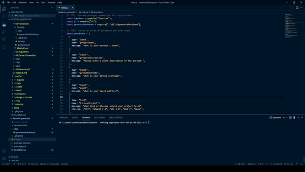

# Readme Generator

[](https://opensource.org/licenses/MIT)

##Table of Contents

- [Description](#description)
- [Installation](#installation)
- [Usage](#usage)
- [License](#license)
- [Questions](#questions)

## Description

This project allows the user to create a Readme just by answering a few questions.

## Installation

To install necessary dependencies, run the following command: </br>

```bash
npm i inquirer
```

## Usage

After installing the dependencies, follow these steps:

1. navigate to the folder directory
2. run command node index.js
3. answer questions provided </br>

After answering the questions, the readMe will be generated in the readme-folder directory. </br>

See below for visual guide on usage: </br>


## License

[](https://opensource.org/licenses/MIT)
This project is licensed under the MIT license.

## Questions

If you have any questions, you can find me in: </br>
Github: https://github.com/RobertCalder1 </br>
Email: rcwebdevelopment@outlook.com
